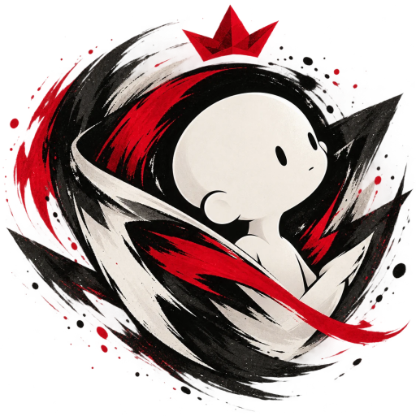

# Nuzka

Free draft pick/ban overlays and tournament management for Arena of Valor (RoV), for OBS.
A Windows app: run the draft from its control panel, and OBS shows the overlays as browser
sources. Formerly **ROV Overlay Tool v3**.

**Download:** the latest installer is on the [Releases](https://github.com/LazyAF-zZzZ/rov_overlay_v3/releases)
page. The app updates itself after that.

## Free, with an optional supporter key

Every feature is free. The overlays carry a small "Nuzka · by LazyAF" watermark.

A **supporter key** removes the watermark and helps pay for new features and updates.

| | |
|---|---|
| **Price** | ฿159 a month |
| **What you get** | No watermark on any overlay, and your name shown as the supporter in the app |
| **How to buy** | In Nuzka: **Support → Get a key**. Pay with PromptPay or a card on Stripe's secure page; the key appears straight away. Paste it in the app. |
| **How long** | One month from the day you pay. The app reminds you 7 days before it runs out; after that the watermark comes back and everything else keeps working. Buy again to renew. |
| **Where it works** | On your own PCs. The key is checked on the PC, so a broadcast never depends on the internet. Please do not share it: a shared key can be switched off. |

**Payments** are handled by [Stripe](https://stripe.com). Nuzka never sees your card or
bank details.

**Refunds:** if your key does not work for you, you get a full refund within 7 days of
buying it. Send your Stripe receipt to the contact below. A refunded key is switched off.

**Contact:** _to be added before release_ <!-- MAKER: an email and/or LINE ID for support and refunds -->

## Licence

Free for tournaments, community streams, school events and personal use. Selling,
reselling, renting or bundling it into anything paid is not allowed, and neither is
passing it off as your own work. See [LICENSE.md](LICENSE.md). The supporter key is sold
only by the maker, through the app.

Nuzka is a fan-made tool. It is not endorsed by Garena or Tencent and does not reflect the
views of anyone officially involved in producing or managing Arena of Valor (RoV). Game
names, hero images and logos belong to their owners.

## For developers

- `desktop/`: the operator app (WPF, .NET 10)
- `backend/`: server, overlays and tests (Node)
- `cloud/`: the key shop, a Cloudflare Worker in front of Stripe
- `docs/PLAN.md`: design, decisions, status and traps

The old v2 is at [rov_pickban_overlay](https://github.com/LazyAF-zZzZ/rov_pickban_overlay).
